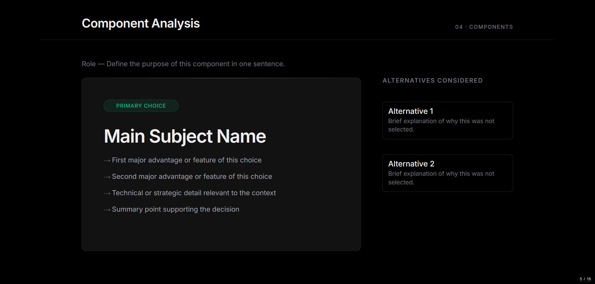
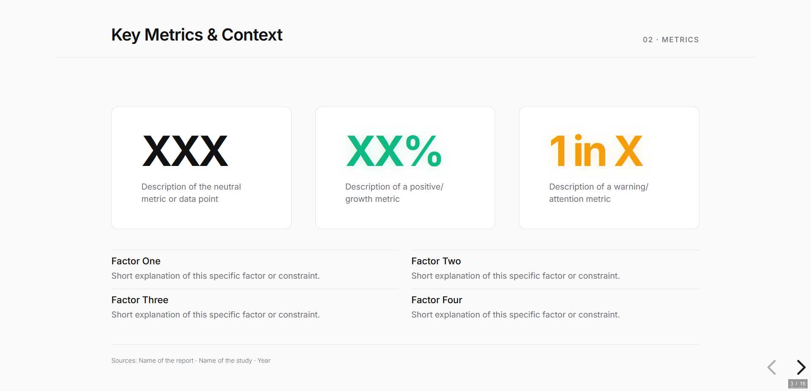
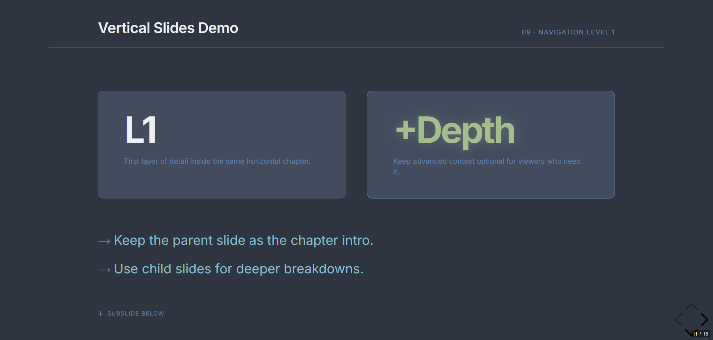

# reveal-js-tplt

Template repository for visual presentation support decks built with Reveal.js.

Current workflow: one HTML file equals one template.

## Repository structure

```text
.
├── LICENSE
├── README.md
├── .gitignore
├── assets/
│   ├── images/
│   ├── media/
│   └── readme-preview/
└── templates/  # Finished templates 
    └── drafts/ # In developement templates
```

## Preview

The `assets/readme-preview/` folder contains the current theme screenshots. Each theme is wrapped in a dropdown so the preview can be hidden when not needed.

<details>
<summary>Vercel Dark</summary>



</details>

<details>
<summary>Vercel Light</summary>



</details>

<details>
<summary>Nord Dark</summary>



</details>

## Template rules

- Keep one self-contained HTML file per template in templates/.
- Use clear naming, for example: vercel-dark.html, editorial-light.html, fintech-grid.html.
- Store deck media under assets/images or assets/media and reference with relative paths.
- Keep speaker notes in each slide using Reveal notes blocks.

## Run locally

You can use any static server. Example with Python:

```bash
python -m http.server 8080
```

Then open:

- http://localhost:8080/templates/vercel-dark.html

## Authoring checklist

- 16:9 layout readability at 1280x720 minimum.
- Contrast check for text and key accents.
- No hardcoded secrets or private URLs.
- Keep placeholders generic in base templates.

## Next planned evolution

- Add more templates in templates/.
- Optionally add shared CSS and JS once multiple templates start repeating the same blocks.
